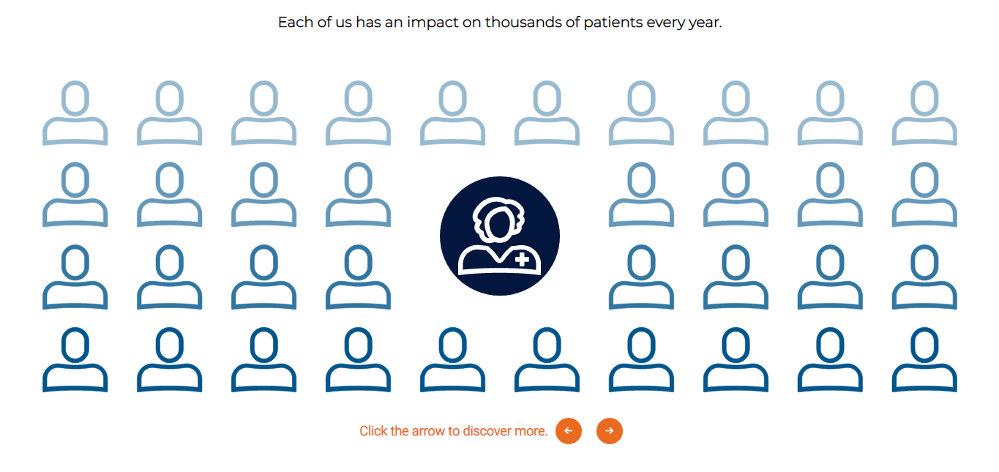

# react slides

Slides between screens with complex animated elements made with gsap. For this project I used React, Webpack, TypeScript, Sass and gsap for the animations. 

[React slides animations](https://react-slides-animation.netlify.app/)

